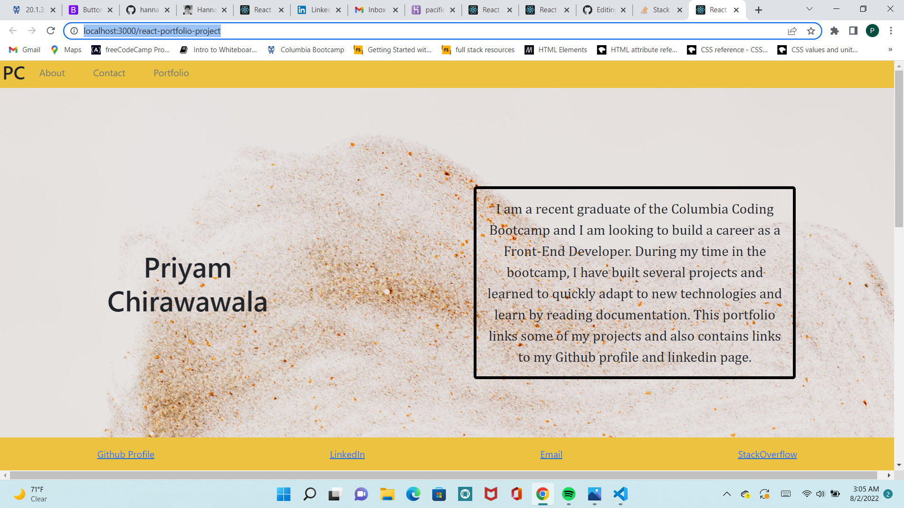

# React Portfolio

## Description

This project was bootstrapped with [Create React App](https://github.com/facebook/create-react-app). This portfolio was created using HTML, CSS, JSX and REACT to showcase a potential employer our skills as we near graduation.

## Table of Contents
* [Usage](#Usage)
* [Deployed-Link](#Video-Link)
* [Credits/Citations](#Credits/Citations)
* [Features](#Features)
* [Applications-Used](#Applications-Used)
* [Screenshot](#Screenshot)

## Usage
This application can be locally invoked by running npm start. However, the deployed heroku link can also be used. 

## Deployed-Link
* **[Click here for deployed link](https://pacific-cliffs-12911.herokuapp.com/#project-challenges)**

## Credits/Citations
* TA Charlie for explaining state, and for troubleshooting bugs 
* TA Charlie for helping create Portfolio and Project components
* Instructor Diego for helping with errors for loading images in project and for conitnuing to troubleshoot these errors with me
* Bootstrap documentation
* module 20 lesson in bootcamp spot - https://courses.bootcampspot.com/courses/1196/pages/20-dot-1-3-set-up-the-project-using-create-react-app?module_item_id=463809
* in class activities for module 20
* Module lessons for understanding components and contact-form in React
* React documentation
* W3 schools for adding links to HTML for opening a page in a new link and for adding email

## Features
This portfolio contains 6 of my projects completed in this bootcamp which I can present to a potential employer. The portfolio also contains my Github page, and links to deployed pages and github repository for each of my projects. The contact form will also enable employers to contact me.

## Applications-Used
* Node Packages
* Bootsrap
* CSS
* JS
* React

## Screenshot

